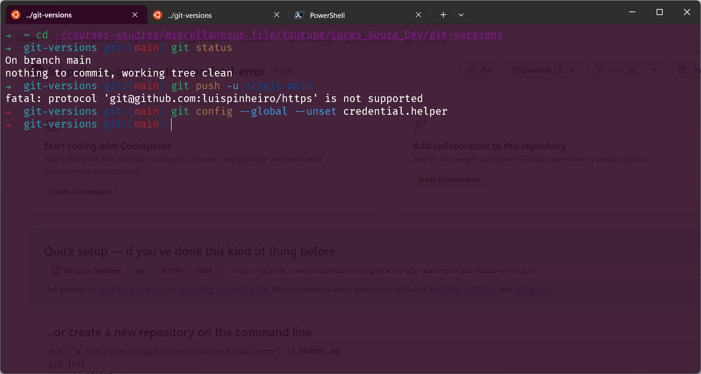
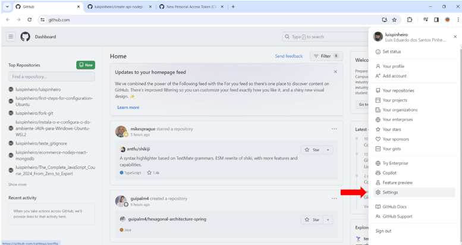
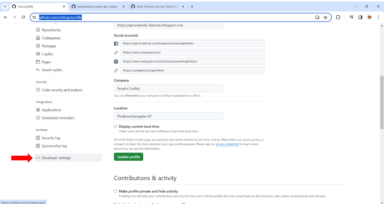
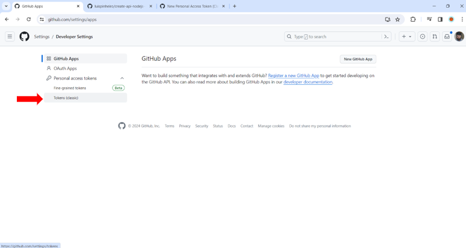
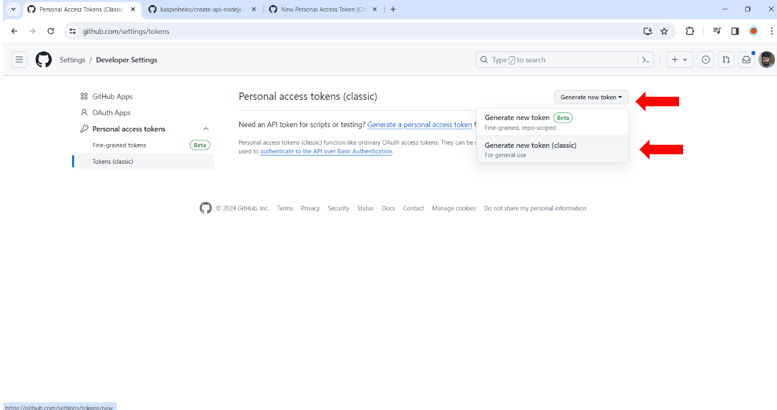
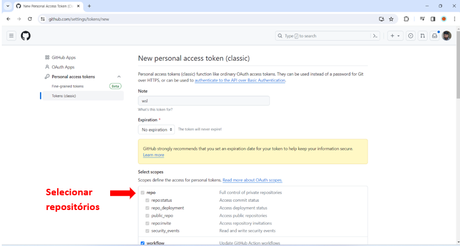
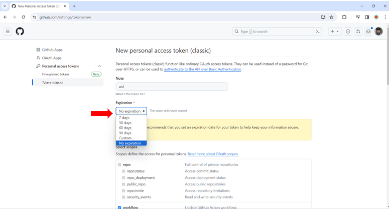
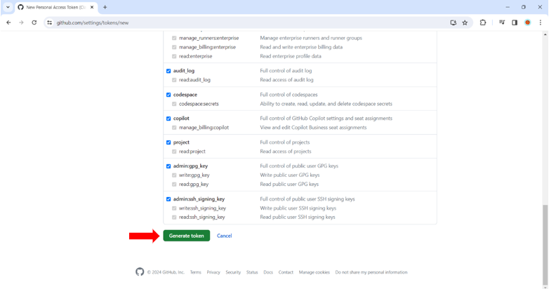
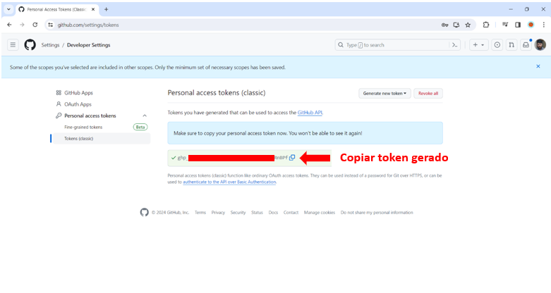

## GIT token authentication, fatal error and problems solution

### Fatal error

Houve uma quebra da url de acesso que pode ser resolvido pelo comando abaixo

```sh
➜  git-versions git:(main) git remote set-url origin https://github.com/luispinheiro/create-api-nodejs--typescript-react-ubuntu-wsl.git
```



### Solicitação de token de acesso

Para uma maior segurança o GitHub recomenda a utilização de um token de acesso pessoal, mas é possível optar pela chave SSH.

Segue abaixo nas imagens um passo a passo para gerar seu token pessoal

Acessar a página do Git para criar o token de acesso e seguir as imagens abaixo
















